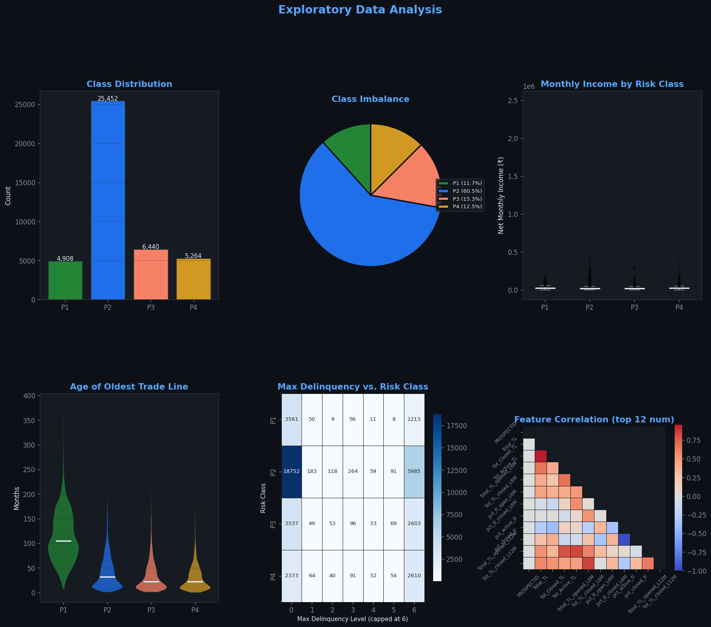
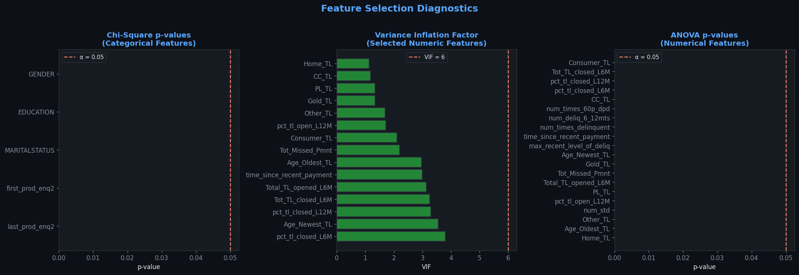
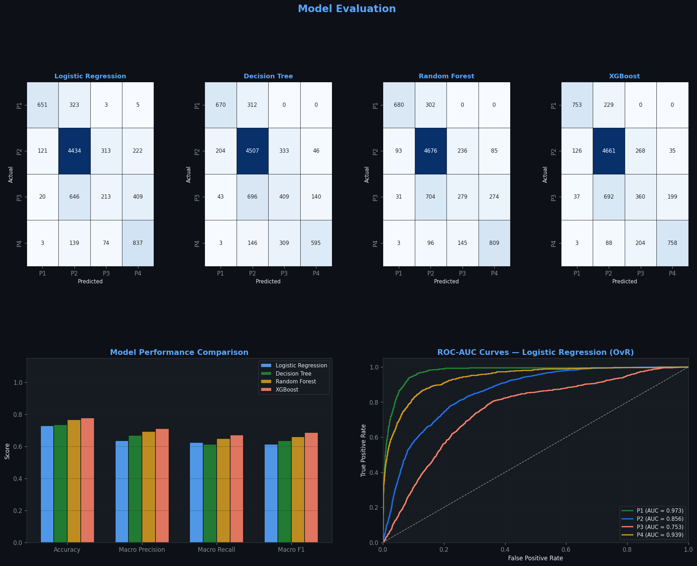

# LoanVati — Intelligent Credit Risk Prediction System

> **Multiclass Borrower Risk Classification using Ensemble ML**


---

## ⚙️ Setup

### Prerequisites
- Python **3.9+**
- `pip` (comes with Python)

### 1 — Clone the repo
```bash
git clone https://github.com/<your-username>/LoanVati.git
cd LoanVati
```

### 2 — Create & activate a virtual environment
```bash
python3 -m venv venv

# macOS / Linux
source venv/bin/activate

# Windows
venv\Scripts\activate
```

### 3 — Install dependencies
```bash
pip install -r requirements.txt
```

### 4 — Run the notebook
```bash
jupyter notebook Credit_Risk_Modelling_Refactored_v2.ipynb
```
Run all cells — the Gradio interface will launch automatically at the end.

> **Note:** The `venv/` directory is excluded from version control via `.gitignore`. Never commit it.

---

## 📋 Table of Contents

1. [Abstract](#abstract)
2. [Introduction](#introduction)
3. [Problem Statement](#problem-statement)
4. [Dataset Description](#dataset-description)
5. [Data Preprocessing](#data-preprocessing)
6. [Modeling Methodology](#modeling-methodology)
7. [Model Evaluation](#model-evaluation)
8. [Model Optimization](#model-optimization)
9. [Gradio Web Interface](#gradio-web-interface)
10. [Conclusion](#conclusion)
11. [Future Work](#future-work)
12. [Team](#team)

---

## Project Overview

| | |
|---|---|
| 🗄️ **Datasets** | `case_study1.csv` (Bank of Baroda) · `case_study2.csv` (CIBIL Bureau) |
| 🎯 **Target** | `Approved_Flag` — Multiclass (P1 / P2 / P3 / P4) |
| ⚙️ **Models** | Logistic Regression, Decision Tree, Random Forest, XGBoost |
| 🔧 **Tuning** | GridSearchCV with 3-fold stratified cross-validation |
| 🚀 **Deployment** | Gradio web interface for live inference |
| 💻 **Stack** | Python, scikit-learn, XGBoost, Gradio, pandas |

---

## Abstract

Credit risk assessment is one of the most critical operations for banks and financial institutions. Before approving a loan, lenders must evaluate whether a borrower is likely to repay. Incorrect decisions lead to financial losses and rising default rates — making an automated, data-driven approach essential.

> 💡 **Key Insight:** This project builds a machine learning credit risk prediction system that classifies borrowers into **four risk tiers** — P1 (most creditworthy) through P4 (highest risk) — using a merged dataset of internal bank records and CIBIL bureau data. The production model is **Logistic Regression**, selected for its interpretability and consistent multiclass performance.

During initial analysis, the value `-99999` was discovered in several numerical columns. Rather than treating these as outliers, investigation confirmed they were **sentinel values representing missing data**. Proper handling was critical to ensure accurate model training.

After cleaning, merging, and performing statistical feature selection (Chi-square, ANOVA, VIF), four models were trained — Logistic Regression, Decision Tree, Random Forest, and XGBoost — each tuned via GridSearchCV. A Gradio web interface was developed for real-time borrower risk inference.

---

## Introduction

**Credit risk** is the possibility that a borrower will fail to meet financial obligations as per agreed terms. For banks, credit risk management is foundational — lending forms the core of their business, and poor assessment leads to high defaults, financial instability, and significant losses.

### Limitations of Traditional Approaches

Traditional loan approval relied on manual review or fixed rule-based frameworks. These systems:

- ❌ Fail to capture **complex patterns and feature interactions**
- ❌ Are **time-consuming** and operationally expensive
- ❌ May introduce **human bias** into decisions
- ❌ Cannot easily scale to thousands of applications daily

### Machine Learning Advantage

ML algorithms analyze large volumes of historical borrower data and learn hidden relationships between features — income, trade line history, loan behavior, repayment patterns. This project adopts a **supervised multiclass classification** approach, predicting one of four risk classes (P1–P4) rather than a simple binary approve/decline.

> ✅ **Strength:** Using stratified splitting, `class_weight='balanced'`, and statistical feature selection, the system delivers **robust predictions even for minority classes** (P3 and P4) — the most financially critical cases.

### Key Data Challenge — Sentinel Values

> ⚠️ **Important Note:** During EDA, sentinel values of `-99999.00` were identified in several financial columns. These are **not outliers** — they are placeholders for missing data. Treating them as real values would severely distort the model. They were replaced with `NaN` and handled via standard missing data removal.

---

## Problem Statement

Financial institutions must evaluate thousands of applications and determine which borrowers are likely to repay. Manual evaluation is slow and inconsistent. Rule-based systems fail to capture complex borrower behavior patterns.

**This project aims to design a machine learning-based credit risk prediction system** that automatically classifies applicants into one of four risk tiers with explainable, consistent predictions.

### Four Risk Tiers (Target: `Approved_Flag`)

| Class | Risk Profile | Credit Quality | Decision |
|:---:|---|---|---|
| **P1** | 🟢 Top Tier | Excellent history, low risk | ✅ **Approve** |
| **P2** | 🔵 Good | Minor concerns, manageable | 🔵 **Conditional** |
| **P3** | 🟡 Marginal | Notable risk factors present | 🟡 **Manual Review** |
| **P4** | 🔴 High Risk | High default probability | ❌ **Decline** |

### System Focus

1. Merging two data sources (internal bank data + CIBIL bureau data)
2. Identifying and handling sentinel values (`-99999`)
3. Statistical feature selection — Chi-square, VIF, ANOVA
4. Training and comparing four classification models
5. Hyperparameter tuning via GridSearchCV with cross-validation
6. Evaluating with accuracy, macro precision, recall, and F1-score
7. Deploying a Gradio web interface for live predictions

---

## Dataset Description

### Data Sources

Two datasets are merged on the shared key `PROSPECTID` via an inner join:

| File | Source | Content |
|---|---|---|
| `case_study1.csv` | Bank of Baroda (internal) | Demographic & financial attributes |
| `case_study2.csv` | CIBIL Bureau | Trade line & repayment history |

### Key Features in the Merged Dataset

| Feature | Type | Description |
|---|---|---|
| `NETMONTHLYINCOME` | Numerical | Net monthly income of borrower |
| `EDUCATION` | Categorical | Ordinal: SSC to Professional (7 levels) |
| `MARITALSTATUS` | Categorical | Married / Single / Others |
| `GENDER` | Categorical | M / F |
| `Age_Oldest_TL` | Numerical | Age of oldest trade line (months) |
| `Age_Newest_TL` | Numerical | Age of newest trade line (months) |
| `time_since_recent_payment` | Numerical | Months since last payment |
| `time_since_recent_enq` | Numerical | Months since last credit enquiry |
| `Time_With_Curr_Empr` | Numerical | Months with current employer |
| `last_prod_enq2` | Categorical | Last product enquiry type |
| `first_prod_enq2` | Categorical | First product enquiry type |
| `max_recent_level_of_deliq` | Numerical | Max recent delinquency level |
| `recent_level_of_deliq` | Numerical | Most recent delinquency level |

### Exploratory Data Analysis



### Data Quality Issues

> ⚠️ **Sentinel values (`-99999`)** were found across multiple numerical columns. These represent *missing data*, not extreme financial measurements. Mishandling them as real values would introduce severe distortions into the model.
>
> **Resolution:** All sentinel values were replaced with `NaN` via `clean_df1(sentinel=-99999.0)`, followed by row-level removal. Only ≈40 rows were dropped — a negligible fraction of the total dataset. Two CIBIL columns with excessive missingness were dropped entirely.

---

## Data Preprocessing

### Step-by-Step Pipeline

1. **Sentinel Replacement**  
   All `-99999` values replaced with `NaN` using `clean_df1(df, sentinel=-99999.0)`. Standard missing-value handling is then applied uniformly downstream.

2. **Row Removal**  
   Rows with any remaining `NaN` values removed. Impact: ≈40 rows dropped — negligible relative to dataset size.

3. **Column Dropping**  
   Two CIBIL columns with excessive missingness dropped before merging — too sparse to impute reliably.

4. **Inner Join**  
   `df1.merge(df2, on='PROSPECTID', how='inner')` — only records present in both data sources are retained, ensuring data completeness.

5. **Identifier Removal**  
   `PROSPECTID` dropped after joining (carries no predictive value).

6. **Feature Encoding**

   | Encoding | Columns |
   |---|---|
   | **Ordinal** | `EDUCATION` mapped to integers 1–7 (SSC=1, 12TH=2, Graduate=3, Under Graduate=4, Post-Graduate=5, Professional=6, Others=7) |
   | **One-hot** | `MARITALSTATUS`, `GENDER`, `last_prod_enq2`, `first_prod_enq2` encoded via `pd.get_dummies()` |
   | **Label Enc.** | Target `Approved_Flag` encoded to integers via `LabelEncoder`; inverse-transformed at inference time |

7. **Statistical Feature Selection**

   Three methods applied in sequence:
   - **Chi-square test** — categorical features: retain at *p* < 0.05
   - **VIF** (Variance Inflation Factor) — iterative removal of multicollinear numerical features above threshold 6.0
   - **ANOVA F-test** — numerical features: retain at *p* < 0.05

   

8. **Scaling and Train/Test Split**

   > ✅ **Zero data leakage:** `StandardScaler` was *fit on the training set only* and *transform-only* applied to the test set. An 80/20 split with `stratify=y` preserved the P1–P4 class distribution in both sets. `RANDOM_STATE=42` enforces reproducibility.

---

## Modeling Methodology

Since `Approved_Flag` has four classes, this is a **multiclass classification** problem. Four models were trained and compared via a shared `train_with_grid_search()` utility (`n_jobs=-1`, `verbose=1`).

### 🚀 Logistic Regression — Production Model

> **Selected as Production Model**
>
> Logistic Regression was selected over higher-accuracy ensemble models because:
> - ✅ Produces **well-calibrated probabilities** — essential for risk-tier thresholds
> - ✅ **Interpretable** — auditable in a lending / regulatory context
> - ✅ **Consistent macro-level performance** across all four risk classes

**Hyperparameter search space:**
- `C`: [0.01, 0.1, 1, 10] · `solver`: [lbfgs, saga] · `max_iter`: [1000]
- `class_weight`: `'balanced'` (fixed) · `multi_class`: `'multinomial'` (fixed)

### Decision Tree

A Decision Tree captures nonlinear feature interactions. `class_weight='balanced'` up-weights minority classes.

**Grid:** `max_depth`: [3, 5, 7] · `min_samples_split`: [2, 5, 10] · `criterion`: [gini, entropy]

### Random Forest

An ensemble of 100–200 trees reduces overfitting vs. a single Decision Tree.

**Grid:** `n_estimators`: [100, 200] · `max_depth`: [5, 10, None] · `min_samples_split`: [2, 5]

### XGBoost

Gradient-boosted trees with `objective='multi:softprob'` and `eval_metric='mlogloss'` for proper multiclass probability output.

**Grid:** `n_estimators`: [100, 200] · `max_depth`: [3, 5] · `learning_rate`: [0.05, 0.1] · `subsample`: [0.8, 1.0]

### GridSearchCV Configuration

| Setting | Value |
|---|---|
| Strategy | Exhaustive grid search across all combinations |
| CV Folds | 3 (stratified) |
| Scoring | Accuracy |
| Parallelism | `n_jobs=-1` (all available cores) |
| Best model | `best_estimator_` stored in `model_registry` |

---

## Model Evaluation

All four models were evaluated on the held-out 20% test set.

### Metrics

| Metric | Description |
|---|---|
| Accuracy | Overall proportion of correct predictions |
| Macro Precision | Average precision across P1, P2, P3, P4 (equal weight per class) |
| Macro Recall | Average recall across all four classes |
| Macro F1 | Harmonic mean of macro precision and recall |
| Per-class P/R/F1 | Individual breakdown for each of P1, P2, P3, P4 |

> ⚠️ **Important Note:** In credit risk, **per-class metrics matter more than overall accuracy**. Classifying a P4 borrower (high risk) as P1 (top tier) is a catastrophic error — far more damaging than the reverse. Per-class precision and recall expose exactly this kind of inter-class failure.

### Evaluation Charts



### Production Model Selection

> 💡 **Logistic Regression** was selected as the production model. While ensemble methods may achieve marginally higher accuracy, Logistic Regression delivers:
> - ▶ **Calibrated probabilities** — critical for defining risk-tier cut-offs
> - ▶ **Interpretable coefficients** — required for regulatory lending compliance
> - ▶ **Consistent recall on P3/P4** — the minority, high-stakes borrower classes
>
> This choice is **intentional and documented** in the `predict()` function.

---

## Model Optimization

### Hyperparameter Tuning

GridSearchCV tested all parameter combinations defined in the central `CONFIG` dictionary. Best parameters were automatically selected via `best_estimator_` and stored in `model_registry`.

### Cross-Validation

3-fold cross-validation was applied during GridSearchCV, ensuring performance estimates are not dependent on a single split. Each fold preserved the class distribution via internal stratification.

### Class Imbalance Handling

> ✅ **Three strategies** combined to handle class imbalance across P1–P4:
> 1. `class_weight='balanced'` on LR, DT, RF — up-weights minority classes P3 and P4 during training
> 2. `stratify=y` during train/test split — preserves the class ratio in both sets
> 3. **Macro F1** reported separately — not fooled by majority class dominance in accuracy

### Feature Refinement

Statistical feature selection (Chi-square, VIF, ANOVA) reduced noise, removed multicollinear features, and retained only the most statistically significant predictors, improving model generalization.

### Inference Pipeline Consistency

> 💡 The `predict(raw_input: dict)` function mirrors the training pipeline **step-for-step:**
> 1. Build single-row DataFrame from `raw_input`
> 2. Ordinal-encode `EDUCATION` via `CONFIG['EDUCATION_MAP']`
> 3. One-hot encode nominal columns
> 4. `reindex()` to align with training feature set (fills unseen OHE columns with 0)
> 5. Scale continuous features using the *training-fitted* scaler
> 6. Predict with `lr_model` and inverse-transform the label
>
> This guarantees **zero training–inference mismatch**.

---

## Gradio Web Interface

A Gradio-based interface provides real-time credit risk inference for non-technical users, organized into three columns.

### Input Fields (13 Total)

| Column | Field | Widget |
|---|---|---|
| **Personal Info** | Education | Dropdown (7 levels) |
| | Marital Status | Dropdown (3 choices) |
| | Gender | Dropdown (M / F) |
| | Net Monthly Income | Number field (Rs.) |
| **Credit Profile** | Last Product Enquiry | Dropdown (6 types) |
| | First Product Enquiry | Dropdown (6 types) |
| | Age of Oldest TL | Slider (0–300 months) |
| | Age of Newest TL | Slider (0–120 months) |
| **Delinquency** | Months Since Payment | Slider (0–120) |
| | Months Since Enquiry | Slider (0–60) |
| | Months With Employer | Slider (0–300) |
| | Max Delinquency Level | Slider (0–10) |
| | Recent Deliq. Level | Slider (0–10) |

### Outputs

| Output | Description |
|---|---|
| **Prediction** | Risk class with color indicator and lending recommendation: 🟢 P1 — Top tier (approve) · 🔵 P2 — Good (approve with conditions) · 🟡 P3 — Marginal (manual review) · 🔴 P4 — High risk (decline) |
| **Probabilities** | Percentage confidence for all four classes (P1–P4) |

> ✅ The Gradio wrapper calls the **full** `predict()` function — all encoding and scaling steps are applied correctly. No pipeline step is bypassed.

---

## Conclusion

This project built a machine learning credit risk prediction system from two merged real-world data sources — internal bank records and CIBIL bureau data. The complete workflow covered data loading, EDA, sentinel value handling, preprocessing, statistical feature selection, multiclass model training, hyperparameter optimization, evaluation, and Gradio deployment.

### Key Achievements

- ✅ Four models trained and compared on a 4-class risk problem
- ✅ Sentinel values correctly identified and handled
- ✅ Zero data leakage — scaler fitted on training set only
- ✅ Stratified splitting preserves class balance
- ✅ Production `predict()` function mirrors the training pipeline step-for-step
- ✅ Live Gradio interface for non-technical users

Logistic Regression was selected as the production model for its interpretability, calibrated probabilities, and consistent performance across all four risk classes. The use of `class_weight='balanced'` and statistical feature selection contributed to robust generalization.

This system demonstrates that machine learning can **meaningfully improve lending decision quality** — replacing slow, biased rule-based systems with accurate, nuanced, and explainable risk stratification.

---

## Future Work

1. **Model Persistence** — Save model, scaler, and encoder as a `joblib` bundle; globals are lost on kernel restart
2. **GridSearch Scoring** — Switch from `accuracy` to `macro-f1` for better optimization on minority classes (P3, P4)
3. **Confusion Matrix** — Add to evaluation; essential for understanding inter-class misclassification costs
4. **XGBoost Imbalance Handling** — Add sample weights (equivalent of `class_weight='balanced'` for XGBoost)
5. **CV Folds** — Raise from 3 to 5 for more stable estimates
6. **Explainability (XAI)** — Integrate SHAP or LIME for regulatory-grade model interpretability
7. **Package Versioning** — Pin `scikit-learn`, `xgboost`, `gradio` in `requirements.txt`
8. **Cloud Deployment** — Deploy via Hugging Face Spaces or Render for persistent public access
9. **Additional Models** — Experiment with LightGBM, CatBoost, and stacked ensembles

---

*February 2025 — Machine Learning Project Report*